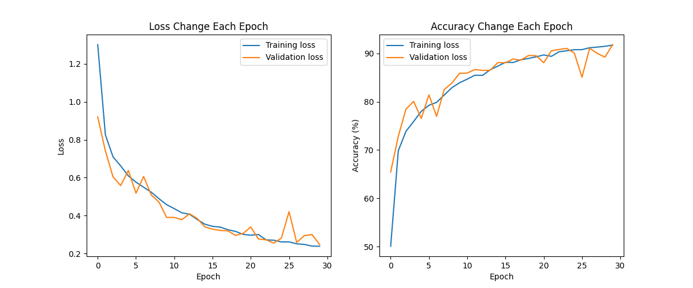

# CNN Image Classification Project

## Project Overview

This project involves building and training a CNN model for image classification using a custom or EuroSAT dataset, featuring at least three classes.

## Requirements

* Data preparation involves selecting and analyzing the dataset, splitting it into training, validation, and test sets, and applying augmentation and normalization techniques. The model architecture should include multiple convolutional and pooling layers, dropout layers, and L2 regularization.

* Testing and optimization will involve experimenting with different CNN architectures and hyperparameters, such as learning rates, batch sizes, and epoch counts. Model evaluation will assess test set performance and visualize results through a confusion matrix and other evaluation metrics.

* A brief results summary should highlight key findings and insights.

## Results

### Custom CNN Model

- **Training Duration:** 30 epochs
- **Performance Metrics:**
  - **Training Loss:** 0.2386, **Training Accuracy:** 91.73%
  - **Validation Loss:** 0.2475, **Validation Accuracy:** 91.83%
  - **Testing Accuracy:** 90.85%

**Model Summary:** See [MyCNN Model Summary](images/MyCNN.txt)

#### Visualizations

Training Loss and Accuracy Graph:

- **Confusion Matrix:**

### MobileNetV2 Architecture

- **Training Duration:** 30 epochs
- **Performance Metrics:**
  - **Training Loss:** 0.1609, **Training Accuracy:** 94.57%
  - **Validation Loss:** 0.1910, **Validation Accuracy:** 93.65%
  - **Testing Accuracy:** 93.78%

**Model Summary:** See [MobileNetV2 Model Summary](images/MobileNetV2.txt)

#### Visualizations

Training Loss and Accuracy Graph:

Confusion Matrix:

## Summary of Results

- The custom CNN model achieved a strong overall testing accuracy of **90.85%**, demonstrating effective classification capabilities.
- Transfer learning using the **MobileNetV2** architecture outperformed the custom CNN, reaching a higher testing accuracy of **93.78%**.
- Both models exhibited well-balanced training and validation performance, with minimal signs of overfitting, as evidenced by comparable loss and accuracy metrics.
